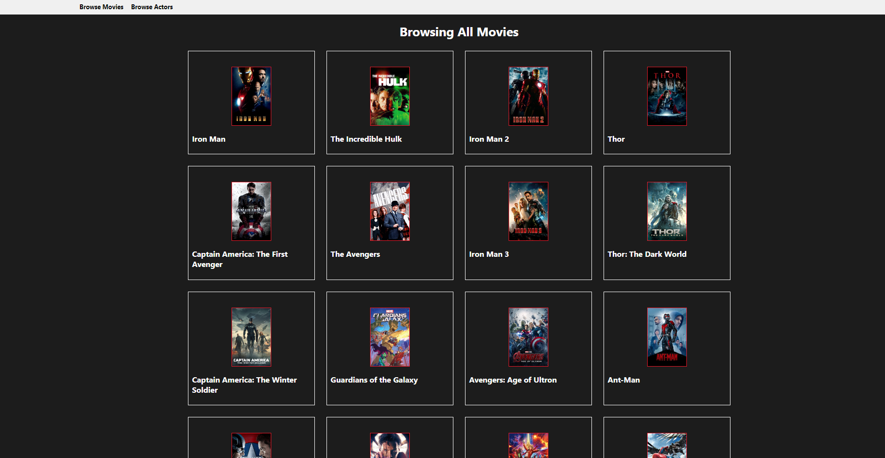
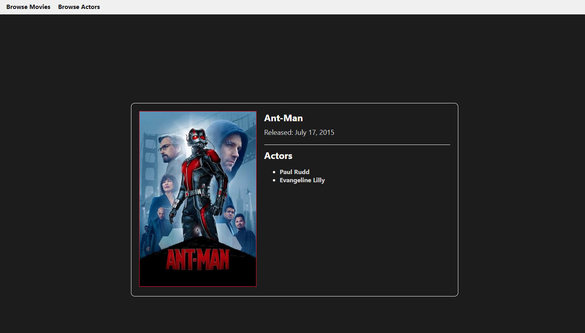
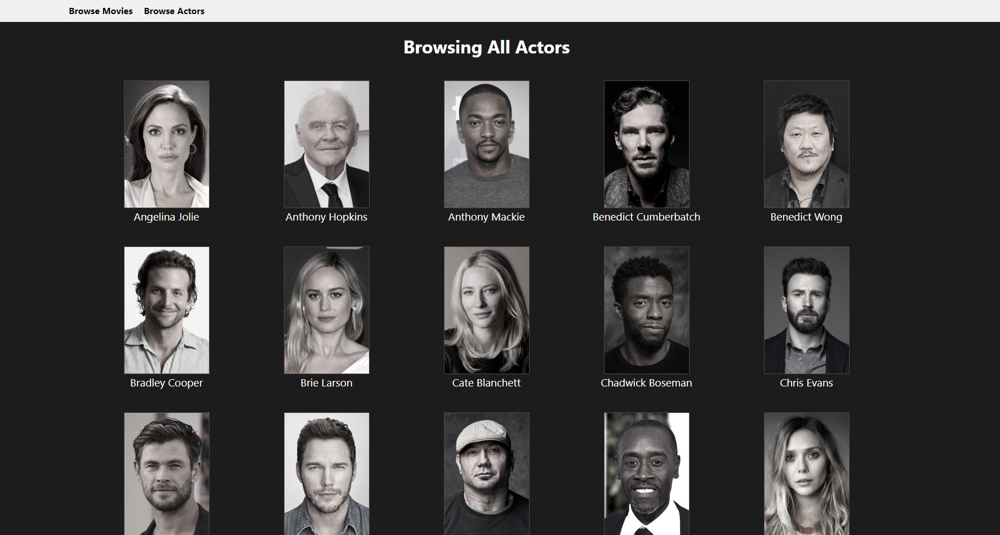
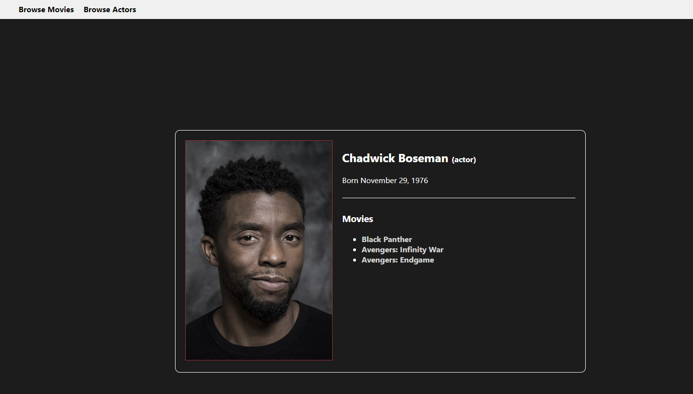

# AVENGERS (simplified IMDB for Avengers-related movies)

## Author's context:
Before this, I had 2 positive experiences with Django and 3 failures with React. 
- I rushed through my first React/Express project with a To-Do list and didn't fully comprehend how React works.
- Then I tried to make Hangman with the MERN stack. It worked locally, but I couldn't get it to deploy because I didn't understand all the pieces.
- Most recently, I tried to make a Trello clone with React frontend and Django backend. In hindsight, I tried to learn too many new things at once

For this reason, I started this project with 2 guiding principles in mind A) don't mix frameworks. Keep this full MERN or full PERN. B) Keep the scope simple and make the pages mostly static at first.

## What I built:
A simplified IMDB, a movie database for Marvel's Avengers (both movies and individual actors).

#### Database (Postgres):
This time with 3 tables:
- Movies (title, release date)
- Actors (first name, last name, sex, date of birth)
- Movie vs. Actor (many to many relationship)

#### Datascraping tool (Python):
Using a combination of Python, Beautiful Soup 4, and ChatGPT assistance, I was able to automate image searches, downloads, and folder creation with 95% blended accuracy.
- Movies (title, release date)
- Actors (first name, last name, sex, date of birth)
- Movie vs. Actor (many to many relationship)

#### Backend:
- Express and 5 API endpoints that would query actors and their respective movies or movies and their respective actors

#### Frontend:

## New technical achievements:
>**EXPRESS:**
Up until now, the only backend framework I had used was Django.

>**JSON:**
Express uses SQL pulls to get values out of a database, and then returns it in an intuitive format, but still in a format I had never seen before. I didn't know what "JSON" meant until this project.

>**REACT:**
Understanding the pre-made and comprehensive purpose of leveraging ViewSet vs. singleton, custom views.

>**BEAUTIFULSOUP4 & REQUESTS:**
Python library being used for web scraping. REQUESTS library used to pull data for Beautiful Soup. First web-scraper was 90% successful in getting movie posters downloaded and placed in an automatically-generated file hierarchy.

## Potential improvements:
>**DATA INTEGRITY:** 
3 of the 31 movies have the wrong poster and 1 of the 38 actors has the wrong person's portrait. Instead of trying to Band-Aid the situation with manual overrides, I decided to let the current accuracy level get memorialized.

>**DEPLOYMENT:** 
In the interest of expediency, I skipped over the deployment but got to tinker around with 4 different platforms.

>**USER MANAGEMENT:** 
If people can log in, they can start having user-specific requests like favorites or upvotes. 

>**PAGINATION:** 
Let's pretend there were 100 MCU movies eventually, and I didn't want them all in one page. I might limit a page to 4 columns, 5 rows, and make each block of 20 cells its own page. 

## Challenges and learnings:
- A database like Postgres can store images, but you shouldn't do it because it's designed to be fast for structured data, not images. There could be financial cost disparities too. Better to just keep it in a static_media folder
- When you install something, dependencies are automatically added to the package.json file. In Django, you need to add manually.
- You might have to sort data in the SQL pull/API endpoint instead of counting on React to do the heavy lifting
- The idea of web-scraping isn't something I considered until the middle of the project. It wasn't so bad to download movie posters, but the idea of putting them in a certain file path tree sounded tedious and annoying, so that pointed me to BeautifulSoup.
- Python already has a "quote_plus" function for encoding strings into search URLs
- Deployment is much more complicated than I would have imagined 1 year ago. Up until now, I have only used Heroku. This time, I touched Digital Ocean, Vercel, and Render. Vercel should have been a non-starter because it can't handle databases.
- CSS has a built-in grayscale tool
- The idea of consolidating all CSS into 1 centralized style guide is not as clear-cut as I thought. There were times where putting formatting, that weren't re-used across multiple components, actually caused more confusion crowding up one file. If I could do it all over again, I would have spent way more time planning CSS.
- The mistake I made was being too literal with how I made the web site - the point of this project was to quickly gain some familiarity with how React and Express work, end of story. If I was to do this a second time, I would have been more strategic about my use of components e.g. splitting up the the portrait component into a grouping of multiple components instead of just relying on CSS to make things look different.